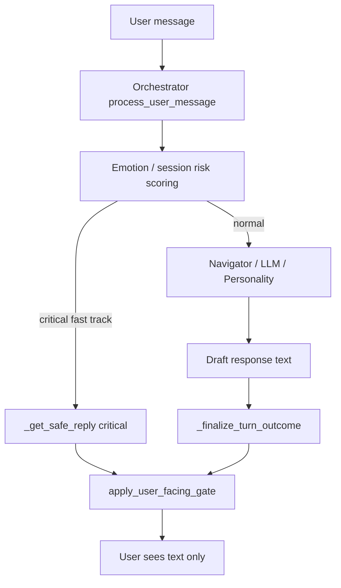
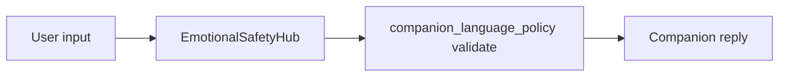
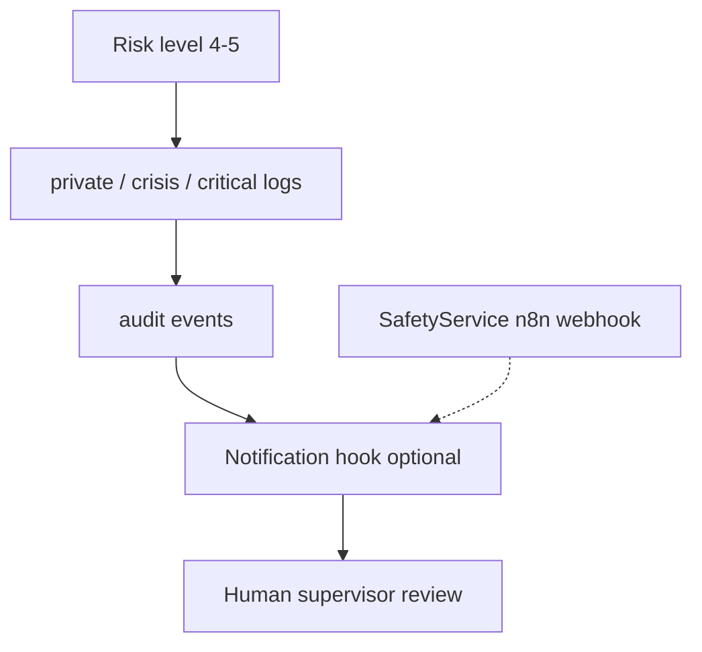

# Safety Critical Path

Version: 0.2 (P3-3 / ADR-001)

## User-visible path (companion layer)

Forbidden on `OUT`: hotlines, ER, hospitalization commands, patient labels, visible escalation notices.

Parallel crisis pipeline (hub tests / dedicated flows):

## Internal path (operations layer)

`SafetyService` is internal-only; it does not produce user chat text (ADR-001).

## Code map

| Step | Module |
|------|--------|
| User-facing gate | `app/clinical/user_facing_gate.py` |
| Policy / forbidden patterns | `app/clinical/companion_language_policy.py` |
| Orchestrator finalize | `app/orchestrator.py` `_finalize_turn_outcome` |
| Orchestrator fallbacks | `app/orchestrator.py` `_get_safe_reply` |
| Crisis hub | `app/services/emotional_safety_hub.py` |
| Navigator fallbacks | `app/services/fracture_map/intelligent_navigator.py` |
| Internal risk / n8n (not chat) | `app/services/safety_service.py` |
| Config defaults | `app/config.py` `DEFAULT_SAFE_REPLIES` |

## Verification

- `pytest tests/clinical/`
- `tests/clinical/test_orchestrator_companion_gate.py`
- `docs/architecture/adr-001-safety-path.md`
- `docs/clinical/companion-language-guide.md`
