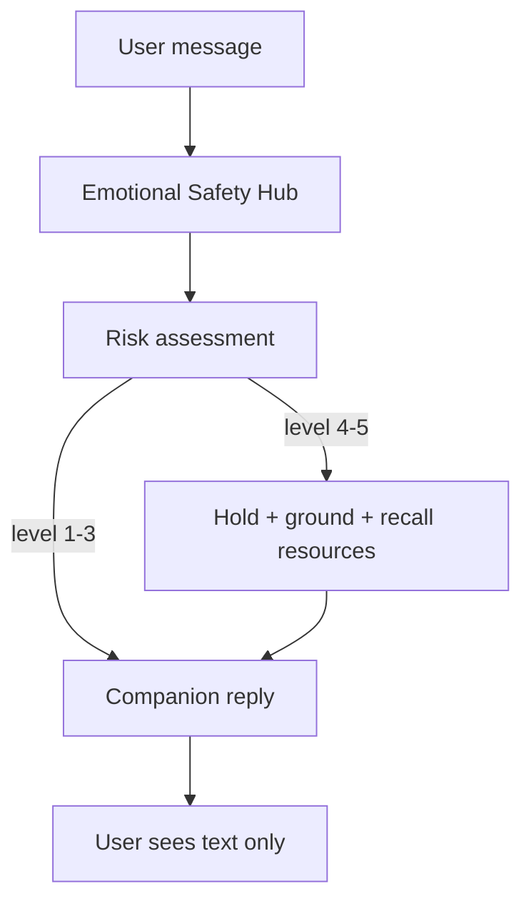
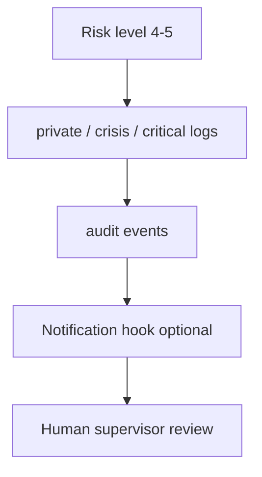

# Safety Critical Path

Version: 0.1 (P1)

## User-visible path (companion layer)

Forbidden on `OUT`: hotlines, ER, hospitalization commands, patient labels, visible escalation notices.

## Internal path (operations layer)

Internal escalation does not change user-visible wording to institutional referral.

## Code map

| Step | Module |
|------|--------|
| Risk scoring | `app/services/emotional_safety_hub.py` |
| Safe replies | `app/clinical/companion_language_policy.py` |
| Navigator safety mode | `app/services/fracture_map/intelligent_navigator.py` |
| Orchestrator fallback | `app/orchestrator.py` `_get_safe_reply` |
| Config defaults | `app/config.py` `DEFAULT_SAFE_REPLIES` |

## Verification

- `pytest tests/clinical/`
- `docs/clinical/companion-language-guide.md`
- `docs/operations/crisis-playbook.md`
