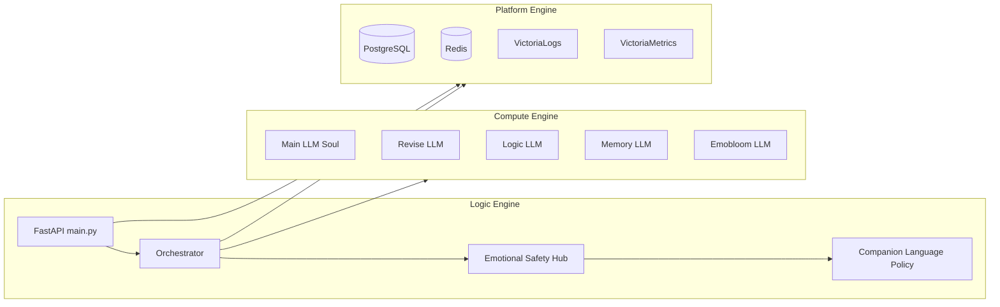

# Three-Engine Architecture

Version: 0.1 (P1)

## Overview

VITA splits responsibilities into three engines (see `app/engines/`).

## Ownership

| Engine | Owner file | Responsibility |
|--------|------------|----------------|
| Platform | `docker-compose.yml`, `app/engines/platform_engine.py` | Postgres, Redis, observability |
| Compute | `seele_v8_5.py`, `app/engines/compute_engine.py` | LLM inference processes |
| Logic | `app/orchestrator.py`, `app/engines/logic_engine.py` | Routing, safety, persona, API |

## Health

- `GET /health` — application health
- `GET /health/engines` — per-engine component status

## Design rules

1. Platform credentials only in `config/.env.compose` (see `docs/security/secrets-policy.md`)
2. User-facing crisis text only via companion language policy
3. Private logs never shipped to VictoriaLogs

See [safety-critical-path.md](safety-critical-path.md) and [../security/threat-model.md](../security/threat-model.md).
