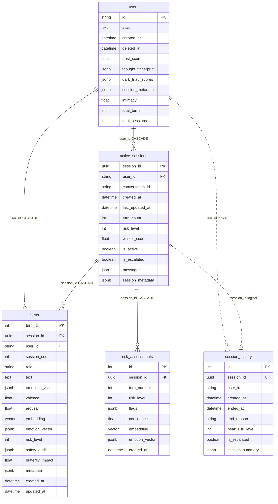
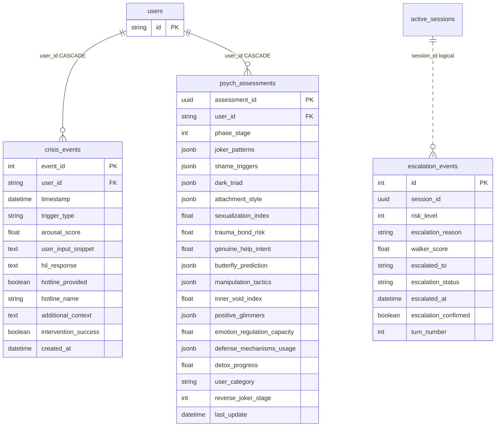
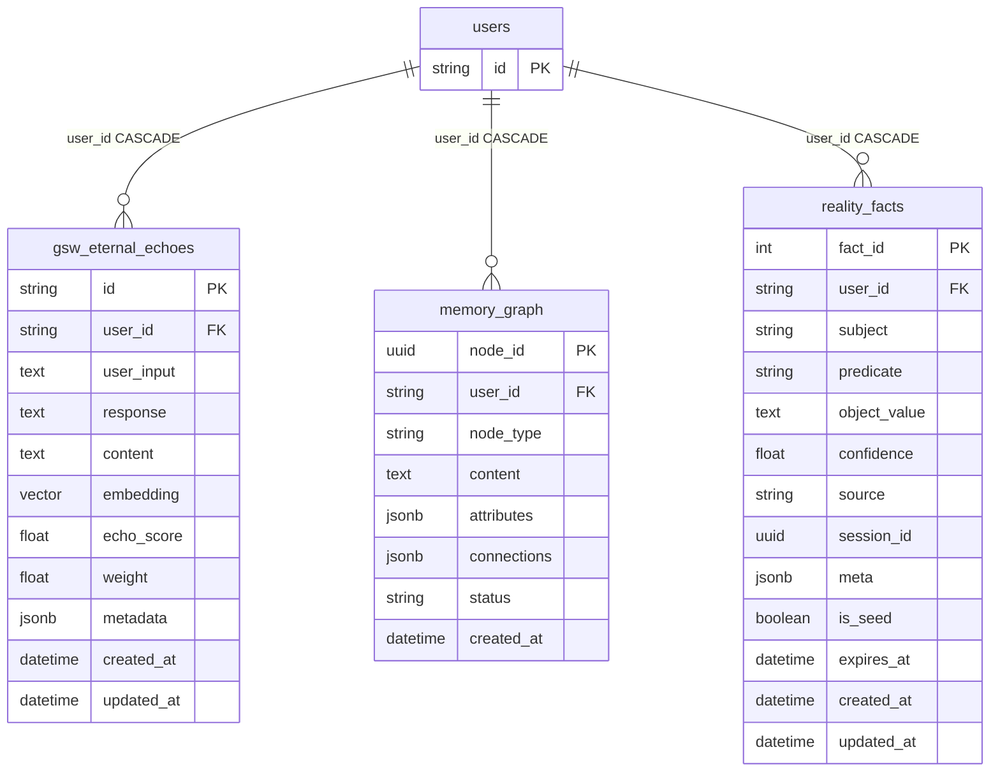
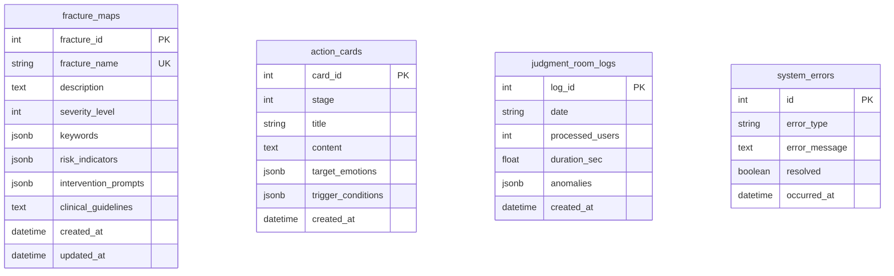

# Entity-Relationship Diagram

Version: 0.2 (P4-4)

Source of truth for columns and constraints: SQLAlchemy models in `app/services/db_manager.py`.

## Scope

| Layer | Storage | Managed by |
|-------|---------|------------|
| Relational ORM tables | PostgreSQL `public` | `db_manager.py` + Alembic revisions |
| Vector index (HNSW) | `gsw_eternal_echoes.embedding` | `init-db/02-gsw-hnsw-index.sql` + bootstrap |
| Apache AGE graph | `vita_memory_graph` (separate from `memory_graph` table) | `init-db/03-age-graph.sql` — **read-only reserve** (ADR-002) |
| pg_cron jobs | `cron.job` | `init-db/04-pg-cron-jobs.sql` |

The relational table `memory_graph` stores JSONB node documents per user (primary structured graph path when feature writes ship). Semantic recall uses `gsw_eternal_echoes` with pgvector HNSW. The AGE graph `vita_memory_graph` is provisioned as an empty read-only shell per [ADR-002](../architecture/adr-002-memory-model.md); it is not used by GSW or memory_chain runtime code.

## Core user and session cluster



`session_history` stores archived session summaries. It has no database FK to `users` or `active_sessions`; application code and retention jobs must keep `user_id` / `session_id` consistent.

## Safety, escalation, and clinical audit



`escalation_events.session_id` is not enforced by FK. Retention and user erasure must delete or anonymize these rows explicitly.

## Memory, GSW, and KAG



GSW echo retention: 30-day rolling delete via pg_cron job `clean-old-gsw-echoes` (see [retention-policy.md](retention-policy.md)).

## Companion state and navigation

```mermaid
erDiagram
    users {
        string id PK
    }

    user_fracture_points {
        int id PK
        string user_id FK
        string trigger_keyword
        jsonb context_tags
        float emotion_spike_score
        float comfort_efficiency
        datetime last_triggered
        float decay_rate
        int trigger_count
        boolean is_active
        datetime created_at
        datetime updated_at
    }

    user_safe_anchors {
        int id PK
        string user_id FK
        string anchor_type
        text content
        float effectiveness_score
        int usage_count
        datetime last_used
        string island_association
        datetime created_at
        datetime updated_at
    }

    user_navigation_history {
        int history_id PK
        string user_id FK
        datetime timestamp
        string fracture_detected
        text fast_think_decision
        text slow_think_decision
        text final_decision
        float user_satisfaction
    }

    intimacy_timeline {
        int record_id PK
        string user_id FK
        datetime timestamp
        float intimacy_score
        float intimacy_delta
        string change_reason
    }

    user_shadow_state {
        string user_id PK_FK
        float pain
        float trust
        float hope
        float loneliness
        jsonb emotion_snapshot
        uuid last_session_id
        int turn_count
        datetime updated_at
        datetime created_at
    }

    psychological_milestones {
        int milestone_id PK
        string user_id FK
        uuid session_id
        string milestone_type
        string title
        text description
        int severity
        jsonb meta
        datetime created_at
    }

    reminders {
        int reminder_id PK
        string user_id FK
        text reminder_text
        datetime target_datetime
        jsonb context
        boolean is_triggered
        datetime created_at
    }

    users ||--o| user_shadow_state : "user_id CASCADE"
    users ||--o{ user_fracture_points : "user_id CASCADE"
    users ||--o{ user_safe_anchors : "user_id CASCADE"
    users ||--o{ user_navigation_history : "user_id CASCADE"
    users ||--o{ intimacy_timeline : "user_id CASCADE"
    users ||--o{ psychological_milestones : "user_id CASCADE"
    users ||--o{ reminders : "user_id CASCADE"
```

## Reference and operations tables (no user FK)



## Cascade summary (user deletion)

Deleting a row in `users` cascades (ON DELETE CASCADE) to all tables with FK `users.id` listed above. Additional explicit deletes required for:

| Table | Reason |
|-------|--------|
| `session_history` | No FK to `users` |
| `escalation_events` | No FK; match by `session_id` from user sessions |

Full erasure API design: [data-classification.md](data-classification.md#user-erasure-design-p4-1).

## Related documents

- [schema-overview.md](schema-overview.md)
- [migrations.md](migrations.md)
- [retention-policy.md](retention-policy.md)
- [data-classification.md](data-classification.md)
