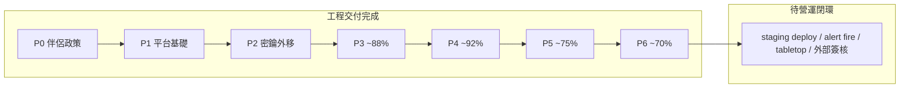

# VITA 12 項治理矩陣（更新版）

Version: 1.1 (P6 sync)  
Date: 2026-07-07  
Baseline: P0–P6 工程交付完成（develop `172eac9`）  
對齊: [execution-program.md](execution-program.md) exit criteria  
狀態: **未達全面專業級** — 工程面多項 ≥70%；**綜合**受營運/組織閉環限制（12 項綜合平均 **~30%**）

## 評分方法

每項治理對照 `execution-program.md` 中該項的 **Exit criteria**（全部為真才算 100%）。

| 欄位 | 定義 |
|------|------|
| **工程 %** | 文件 + 程式 + CI 可驗證之完成度 |
| **營運 %** | staging/生產演練、監控告警 live、runbook 演練之完成度 |
| **組織 %** | RACI 實名、臨床/產品正式簽核之完成度（單人專案可標 N/A） |
| **綜合 %** | `min(工程, 營運, 組織*)`；無組織要求者以 `min(工程, 營運)` |
| **達標等級** | 綜合 &lt;40 雛形 · 40–69 工程基線 · 70–89 工程達標 · 90–99 近營運 · 100 專業級 |

\* 第 1、11 項含組織維度；其餘以工程+營運為主。

## 程式總覽

| 指標 | 數值 |
|------|------|
| 12 項綜合平均（min 工程/營運/組織） | **~30%** |
| 12 項工程面平均 | **~85%** |
| 綜合 ≥70%（專業級前置） | **0 / 12** |
| 工程面 ≥70% | **12 / 12** |
| 專業級（綜合 = 100%） | **0 / 12** |
| 階段 P3 | ~**88%** |
| 階段 P4 | ~**92%** |
| 階段 P5 | ~**75%**（工程完成；營運演練待辦） |
| 階段 P6 | ~**70%**（repo 完成；外部 roster/PRD 簽核待 go-live） |



---

## 12 項治理矩陣

| # | 治理項 | 工程 % | 營運 % | 組織 % | 綜合 % | 達標等級 | 主要證據 | 剩餘缺口 |
|---|--------|--------|--------|--------|--------|----------|----------|----------|
| 1 | 需求分析 | 92 | 0 | 70 | **0** | 工程達標 | PRD Approved v1.0、traceability 100%、companion freeze、CD-002 關 | 外部 PRD 簽核記錄（production 前） |
| 2 | 系統架構 | 92 | 25 | — | **25** | 雛形 | `three-engines.md`、`safety-critical-path.md`、ADR-001/002 | 全鏈路 SLO 標籤；Compute 外部 Seele 依賴 |
| 3 | 資料庫設計 | 90 | 45 | — | **45** | 雛形 | ER、data-classification、retention、Alembic、TD-001 關 | 抹除 API；retention 營運 dry-run 記錄 |
| 4 | 資安防禦 | 82 | 15 | — | **15** | 雛形 | threat model、sanitizer、red-team CI、key-rotation runbook | staging 金鑰輪替演練未記錄 |
| 5 | 效能優化 | 85 | 20 | — | **20** | 雛形 | `slo.md`、`vita_chat_processing_seconds`、危機 histogram | 生產 p95 基線未量測 |
| 6 | 自動化測試 | 88 | 35 | — | **35** | 雛形 | CI 多套件、SC-001..010、alignment、governance/observability tests | 覆蓋率門檻；真 LLM E2E 有限 |
| 7 | 版本控制 | 75 | 25 | 35 | **25** | 雛形 | branch-strategy、語意 commit、PR template（含臨床簽核） | branch protection 待確認；release tag 流程 |
| 8 | CI/CD | 80 | 30 | — | **30** | 雛形 | `ci.yml`（含 P5/P6 verify）、`deploy.yml` smoke+SSH、rollback 腳本 | staging deploy/rollback **外部記錄**；TD-009 |
| 9 | 線上監控 | 78 | 35 | — | **35** | 雛形 | Grafana/VM/Logs 佈署、crisis metrics、TD-008 關、`verify_p5_monitoring` | staging **告警 fire**；webhook live 證明 |
| 10 | 異狀除錯 | 85 | 45 | — | **45** | 雛形 | Runbooks **v1.0**、on-call/troubleshooting、drill、tabletop 模板 | 外部 roster 實名；tabletop 外部記錄 |
| 11 | 團隊協作 | 75 | 0 | 40 | **0** | 雛形 | RACI v1.0、clinical-signoff、PR 強制勾選、`verify_p6_team_governance` | 外部 roster；P6-1.4 release 歸檔 |
| 12 | 技術債 | 88 | 55 | 50 | **55** | 雛形 | TD-003/008 關、CD-002 關、Review log、audit/verify 腳本 | TD-009；月審 release candidate 制度化 |

### Exit criteria 勾選（對齊 execution-program，2026-07-07）

| # | Exit criteria | 狀態 |
|---|---------------|------|
| 1 | PRD v1.0 signed | 部分 — repo **Approved v1.0**；外部 `prd-v1-clinical-approval-checklist` 待 production 前 |
| 1 | Traceability matrix → code + tests | 是 — `check_traceability.py` CI gate；SC-001..010 |
| 2 | Single crisis owner path documented | 是 — ADR-001 + `safety-critical-path.md` |
| 2 | ADR for dual-path resolution | 是 — ADR-002（memory）；TD-001 關 |
| 3 | ER diagram in repo | 是 — `docs/database/er-diagram.md` |
| 3 | Alembic primary for schema changes | 是 — TD-002 關 |
| 3 | Retention jobs verified | 部分 — `retention_batch.py` + pg_cron；營運 dry-run **外部記錄**待補 |
| 4 | Key rotation runbook executed in staging | 否 |
| 4 | Red-team tests in CI | 是 — SC-006..010 |
| 4 | Injection mitigations documented | 是 — `prompt-injection-mitigations.md` |
| 5 | SLO doc with measured baselines | 部分 — `slo.md` 有；**生產 p95 量測**待補 |
| 5 | Crisis path latency on `/metrics` | 是 — histogram + crisis counters |
| 6 | Unit + integration + clinical + red-team in CI | 是 — `ci.yml` test-and-alignment |
| 6 | Coverage gate on critical paths | 否 |
| 7 | Full repo in git | 是 |
| 7 | main/develop protected | 待確認（GitHub 遠端設定） |
| 7 | Release tags | 部分 |
| 8 | Build, deploy, smoke, rollback on staging | 部分 — `deploy.yml` + `rollback.sh` + `deploy.md` 附錄；**GHA staging 實跑記錄**待補 |
| 8 | Secrets via GitHub Encrypted Secrets only | 是 — deploy 設計符合 |
| 9 | Grafana dashboards live | 部分 — provisioning + 本地 `verify_p5_monitoring`；**staging/production live** 待證明 |
| 9 | VM scrape vita-api | 部分 — scrape 設定 + 本地驗證；staging 持續 UP 待證明 |
| 9 | Clinical alerts routed | 部分 — `contactpoints.yaml` / `policies.yaml` / LogsQL 在 repo；**告警 fire + webhook** 待證明 |
| 10 | Runbooks v1.0 | **是** — `crisis-playbook.md`、`incident.md` v1.0（P5-2） |
| 10 | On-call roster external | 部分 — `on-call.md` 模板 + RACI 外部 roster 政策；**實名**待 go-live 前 |
| 10 | Escalation notifications not stub | 是 — `escalation_notifier.py` + `drill_escalation_webhook.py` |
| 11 | RACI published | 是 — `RACI.md` v1.0（P6-1）；外部 roster 位置欄待填 |
| 11 | PR + clinical sign-off enforced | 是 — `.github/PULL_REQUEST_TEMPLATE.md` 強制區塊 |
| 12 | TD/CD closed or accepted with expiry | 部分 — **TD-009** 開（Low，Q3 2026）；High/CD 已關 |
| 12 | Monthly review | 部分 — Review log 已建立（2026-07-06/07）；**release candidate 月審**待制度化 |

---

## 階段完成度（對齊 execution-program）

| 階段 | 治理項 | 完成度 | 說明 |
|------|--------|--------|------|
| P0–P2 | 政策、CI 雛形、臨床 SC、密鑰外移 | **100%** | TD-P0-*、TD-006、CD-001 關 |
| P3 | #1 部分、#2、#6、#7 部分、#8 部分 | **~88%** | traceability、ADR-001、red-team、deploy 骨架 |
| P4 | #3、#4、#5、#12 (TD-001) | **~92%** | ER、資安、SLO/metrics、ADR-002 |
| P5 | #9、#10、#12 | **~75%** | 監控/runbook/TD 程式完成；**營運演練**待辦 |
| P6 | #1、#11、CD-002 | **~70%** | RACI、簽核模板、PRD Approved v1.0；**外部簽核**待 go-live |

---

## P5 任務清單（維運閉環）

對齊 [execution-program.md § P5](execution-program.md#p5--operations-closure)。

### P5-1 線上監控（治理 #9）

| 序 | 任務 | 交付物 | 驗收 | 狀態 |
|----|------|--------|------|------|
| P5-1.1 | Grafana crisis dashboard provision | `grafana/provisioning/` | 本地 verify OK | Done（工程） |
| P5-1.2 | VM scrape vita-api | `victoriametrics-scrape.yml` | targets UP | Done（工程） |
| P5-1.3 | 臨床告警路由 | alerting YAML + `monitoring.md` v1.0 | **告警 fire** | 部分 |
| P5-1.4 | steady-state missed = 0 | `verify_p5_monitoring.py` | 本地通過；staging 7 日記錄 | 部分 |

**Verify:**

```powershell
python scripts/observability/verify_p5_monitoring.py --skip-steady-state
python scripts/observability/investigate_missed_interceptions.py
```

### P5-2 異狀除錯（治理 #10）

| 序 | 任務 | 交付物 | 驗收 | 狀態 |
|----|------|--------|------|------|
| P5-2.1 | crisis-playbook、incident → v1.0 | docs/operations/ | 含 L4–5 + 監控 | Done |
| P5-2.2 | on-call.md | 模板 | Ops 確認聯絡鏈 | Done |
| P5-2.3 | troubleshooting.md | symptom → command | DB/LLM/Redis/監控 | Done |
| P5-2.4 | drill_escalation_webhook.py | scripts/observability/ | dry-run OK；**webhook live** | 部分 |
| P5-2.5 | tabletop S2 | tabletop-s2-language-regression.md | **外部記錄** < 30 min | Pending |

**Verify:**

```powershell
python scripts/observability/drill_escalation_webhook.py --dry-run
python -m pytest tests/platform/test_drill_escalation_webhook.py -q
```

### P5-3 技術債程序（治理 #12）

| 序 | 任務 | 交付物 | 驗收 | 狀態 |
|----|------|--------|------|------|
| P5-3.1 | execute_update 審計 | audit_execute_update.py | TD-003 關 | Done |
| P5-3.2 | TD-008 關 | tech-debt-register | 監控 codified | Done |
| P5-3.3 | deploy+rollback 記錄模板 | deploy.md 附錄 | **GHA 實跑** | 部分 |
| P5-3.4 | Review log | tech-debt-register | 2026-07 記錄 | Done |

**Verify:**

```powershell
python scripts/governance/verify_p5_tech_debt.py
python scripts/governance/audit_execute_update.py
```

---

## P6 任務清單（組織與臨床治理）

對齊 [execution-program.md § P6](execution-program.md#p6--organization-and-clinical-governance)。

### P6-1 團隊協作（治理 #11）

| 序 | 任務 | 交付物 | 驗收 | 狀態 |
|----|------|--------|------|------|
| P6-1.1 | RACI v1.0 + 外部 roster 政策 | RACI.md | 矩陣完成 | Done |
| P6-1.2 | clinical-signoff-template | 模板 | SC-001..010 | Done |
| P6-1.3 | PR template 臨床強制勾選 | PULL_REQUEST_TEMPLATE.md | CI 可驗 | Done |
| P6-1.4 | Production release 簽核歸檔 | 外部儲存 | 最近一次 release | Pending go-live |

### P6-2 需求最終簽核（治理 #1）

| 序 | 任務 | 交付物 | 驗收 | 狀態 |
|----|------|--------|------|------|
| P6-2.1 | PRD 臨床審閱清單 | prd-v1-clinical-approval-checklist.md | **外部** SC 全勾 | Template ready |
| P6-2.2 | PRD Approved v1.0 | PRD.md | repo 完成 | Done |
| P6-2.3 | forbidden-pattern 凍結 | companion-language-guide v1.0 | ADR + 簽核政策 | Done |
| P6-2.4 | CD-002 關 | tech-debt-register | Closed P6-2 | Done |

**Verify:**

```powershell
python scripts/governance/verify_p6_team_governance.py
python scripts/governance/verify_p6_requirements_signoff.py
```

---

## Master 驗證清單（12 項全綠前必跑）

```powershell
python -m pytest tests/clinical/ tests/metrics/ tests/platform/ tests/security/ tests/governance/ tests/db/ -q
python app/tests/system_alignment_checker.py
python scripts/security/scan_secrets.py
python scripts/security/pip_audit_check.py
python scripts/governance/check_traceability.py
python scripts/governance/verify_p5_tech_debt.py
python scripts/governance/verify_p6_team_governance.py
python scripts/governance/verify_p6_requirements_signoff.py
python scripts/observability/verify_p5_monitoring.py --skip-steady-state
docker compose --env-file config/.env.compose.ci config --quiet
python scripts/dev/verify_platform_postgres.py
alembic current
```

**治理簽核會議議程（專業級營運就緒）：**

1. 走查 traceability matrix  
2. 開放 TD 審查（High = 0 或 waiver；目前僅 TD-009 Low）  
3. Staging deploy + rollback 示範（`deploy.md` 附錄記錄）  
4. Grafana + 臨床告警 fire test + webhook live drill  
5. RACI 外部 roster + PRD 臨床簽核 + release 歸檔備查  

---

## 後 P5/P6 營運閉環（建議順序）

| 序 | 焦點 | 提升治理項 | 交付 |
|----|------|------------|------|
| 1 | Staging deploy + rollback | #8 | GHA `dry_run=false` + DEP-DRILL 記錄 |
| 2 | 告警 fire + webhook live | #9、#10 | Grafana test + `drill_escalation_webhook.py` |
| 3 | Tabletop S2 | #10 | 外部記錄 < 30 min |
| 4 | 外部 roster + PRD 簽核 | #1、#11 | CLIN-SIGN-PRD-v1-001 + RACI roster |
| 5 | Branch protection + p95 量測 | #7、#5 | GitHub 設定 + SLO baseline |

完成上表後，12 項綜合平均預估 **~55–65%**；距 **100% 專業級**仍須生產環境持續量測、覆蓋率門檻、staging 金鑰輪替等增量項。

---

## 相關文件

- [execution-program.md](execution-program.md) — 階段路線圖（權威來源）
- [tech-debt-register.md](tech-debt-register.md) — TD/CD 登記
- [RACI.md](RACI.md) — 責任矩陣 v1.0
- [clinical-signoff-template.md](clinical-signoff-template.md) — per-PR 臨床簽核
- [prd-v1-clinical-approval-checklist.md](prd-v1-clinical-approval-checklist.md) — PRD 基線簽核（外部）
- [PRD.md](../requirements/PRD.md) — Approved v1.0
