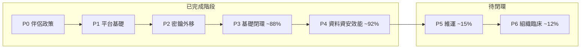

# VITA 12 項治理矩陣（更新版）

Version: 1.0  
Date: 2026-07-05  
Baseline: P0–P4 工程交付完成（develop `a118857`）  
對齊: [execution-program.md](execution-program.md) exit criteria  
狀態: **未達全面專業級** — 工程基線約 **78%**，營運閉環約 **18%**，組織閉環約 **15%**

## 評分方法

每項治理對照 `execution-program.md` 中該項的 **Exit criteria**（全部為真才算 100%）。

| 欄位 | 定義 |
|------|------|
| **工程 %** | 文件 + 程式 + CI 可驗證之完成度 |
| **營運 %** | staging/生產演練、監控告警 live、runbook 演練之完成度 |
| **組織 %** | RACI 實名、臨床/產品正式簽核之完成度（單人專案可標 N/A） |
| **綜合 %** | `min(工程, 營運, 組織*)`；無組織要求者以 `min(工程, 營運)` |
| **達標等級** | 綜合 &lt;40 雛形 · 40–69 工程基線 · 70–89 工程達標 · 90–99 近營運 · 100 專業級 |

\* 第 1、11 項含組織維度；其餘以工程+營運為主。

## 程式總覽

| 指標 | 數值 |
|------|------|
| 12 項綜合平均 | **52%** |
| 工程基線達標（綜合 ≥70%） | **6 / 12** |
| 專業級達標（綜合 = 100%） | **0 / 12** |
| 階段 P3 | ~**88%** |
| 階段 P4 | ~**92%** |
| 階段 P5 | ~**75%** |
| 階段 P6 | ~**70%** |



---

## 12 項治理矩陣

| # | 治理項 | 工程 % | 營運 % | 組織 % | 綜合 % | 達標等級 | 主要證據 | 剩餘缺口 |
|---|--------|--------|--------|--------|--------|----------|----------|----------|
| 1 | 需求分析 | 92 | 0 | 70 | **0** | 工程達標 | PRD Approved v1.0、traceability 100%、companion freeze | 外部 PRD 簽核記錄（production 前） |
| 2 | 系統架構 | 92 | 25 | — | **25** | 雛形 | `three-engines.md`、`safety-critical-path.md`、ADR-001/002 | 危機路徑無全鏈路 SLO 標籤；Compute 依賴外部 Seele |
| 3 | 資料庫設計 | 90 | 45 | — | **45** | 雛形 | ER v0.2、data-classification、retention、Alembic 基線、TD-001 關 | `DELETE /user/{id}` 抹除 API 未實作；retention 排程營運驗證待記錄 |
| 4 | 資安防禦 | 82 | 15 | — | **15** | 雛形 | `threat-model.md`、sanitizer、red-team CI、`key-rotation-runbook.md` | staging 金鑰輪替演練未記錄；威脅模型 v0.1 |
| 5 | 效能優化 | 85 | 20 | — | **20** | 雛形 | `slo.md` v0.3、`vita_chat_processing_seconds`、multiprocess metrics | 生產 p95 基線未量測；危機路徑優先仍為指標層 |
| 6 | 自動化測試 | 88 | 35 | — | **35** | 雛形 | CI 8+ 套件、SC-001..010、alignment checker、governance tests | 無覆蓋率門檻；真 LLM E2E 有限 |
| 7 | 版本控制 | 75 | 25 | 35 | **25** | 雛形 | `branch-strategy.md`、develop/main、語意 commit、PR template | GitHub branch protection 待確認；release tag 流程未 formalize |
| 8 | CI/CD | 80 | 30 | — | **30** | 雛形 | `ci.yml` 完整、`deploy.yml` build+smoke+SSH | TD-009 partial；staging deploy+rollback 演練未記錄 |
| 9 | 線上監控 | 72 | 22 | — | **22** | 雛形 | VictoriaLogs/Metrics、crisis metrics、Grafana JSON 在 repo | TD-008 partial；告警路由、staging live 未證明 |
| 10 | 異狀除錯 | 85 | 45 | — | **45** | 雛形 | Runbooks v1.0、on-call/troubleshooting、drill script、tabletop template | 實名 roster 未填；tabletop 外部記錄待執行 |
| 11 | 團隊協作 | 75 | 0 | 40 | **0** | 雛形 | RACI v1.0、clinical-signoff-template、PR 強制勾選 | 外部 roster 實名；P6-1.4 release 歸檔 |
| 12 | 技術債 | 88 | 55 | 50 | **55** | 雛形 | TD-003/008 關；Review log；audit script | TD-009 開；GHA staging 實跑待 secrets |

### Exit criteria 勾選（對齊 execution-program）

| # | Exit criteria | 狀態 |
|---|---------------|------|
| 1 | PRD v1.0 signed | 部分 — Approved v1.0 in repo; external advisor record before production |
| 1 | Traceability matrix → code + tests | 是 — CI gate |
| 2 | Single crisis owner path documented | 是 — ADR-001 + safety-critical-path |
| 2 | ADR for dual-path resolution | 是 — ADR-002 (memory) |
| 3 | ER diagram in repo | 是 |
| 3 | Alembic primary for schema changes | 是 — TD-002 關 |
| 3 | Retention jobs verified | 部分 — 腳本+pg_cron 有，營運 dry-run 記錄待補 |
| 4 | Key rotation runbook executed in staging | **否** |
| 4 | Red-team tests in CI | 是 |
| 4 | Injection mitigations documented | 是 |
| 5 | SLO doc with measured baselines | 部分 — 文件有，量測待補 |
| 5 | Crisis path latency on `/metrics` | 是 — histogram wired |
| 6 | Unit + integration + clinical + red-team in CI | 是 |
| 6 | Coverage gate on critical paths | **否** |
| 7 | Full repo in git | 是 |
| 7 | main/develop protected | 待確認（遠端設定） |
| 7 | Release tags | 部分 |
| 8 | Build, deploy, smoke, rollback on staging | 部分 — deploy.yml 有，rollback 演練未記錄 |
| 8 | Secrets via GitHub Encrypted Secrets only | 是 — deploy 設計符合 |
| 9 | Grafana dashboards live | 部分 — JSON 在 repo，staging live 未證明 |
| 9 | VM scrape vita-api | 部分 — 設定在 repo |
| 9 | Clinical alerts routed | **否** |
| 10 | Runbooks v1.0 | **否** — 仍 v0.1 |
| 10 | On-call roster external | **否** |
| 10 | Escalation notifications not stub | 是 — webhook 模組已實作 |
| 11 | RACI published | 部分 — v1.0 + 外部 roster 政策 |
| 11 | PR + clinical sign-off enforced | 是 — PR template 強制區塊 |
| 12 | TD/CD closed or accepted with expiry | 部分 — TD-009 開；CD-002 關 P6-2 |
| 12 | Monthly review | **否** |

---

## 階段完成度（對齊 execution-program）

| 階段 | 治理項 | 完成度 | 說明 |
|------|--------|--------|------|
| P0–P2 | 政策、CI 雛形、臨床 SC、密鑰外移 | **100%** | 已關閉 TD-P0-*、TD-006、CD-001 |
| P3 | #1 部分、#2、#6、#7 部分、#8 部分 | **~88%** | PRD/traceability/ADR-001/red-team/deploy 骨架 |
| P4 | #3、#4、#5、#12 (TD-001) | **~92%** | ER、資安、SLO/metrics、ADR-002 |
| P5 | #9、#10、#12 收尾 | **~75%** | P5-1/2/3 工程完成；tabletop/GHA staging 營運待辦 |
| P6 | #1 最終、#11、#12 | **~12%** | RACI 實名、臨床簽核、PRD 最終核准 |

---

## P5 任務清單（維運閉環）

對齊 [execution-program.md § P5](execution-program.md#p5--operations-closure)。

### P5-1 線上監控（治理 #9）— 目標綜合 70%+

| 序 | 任務 | 交付物 | 驗收 | 關聯 TD |
|----|------|--------|------|---------|
| P5-1.1 | 確認 Grafana crisis dashboard 在 staging provision | `grafana/provisioning/dashboards/` | Panel 顯示 interception rate、p95 | TD-008 |
| P5-1.2 | 確認 VM scrape vita-api `/metrics` | `config/observability/victoriametrics-scrape.yml` | `curl metrics` 有 `vita_crisis_*` | TD-008 |
| P5-1.3 | 定義臨床告警路由（LogsQL + Grafana alert） | `monitoring.md` → v1.0 | 注入 missed log 觸發測試告警 | TD-008 |
| P5-1.4 | steady-state：missed-interception = 0 | 營運記錄 | staging 7 日穩態截圖或記錄 | — |

**Verify:**

```powershell
docker compose --env-file config/.env.compose up -d grafana victoriametrics vita-api
curl -s http://127.0.0.1:8080/metrics | findstr vita_crisis
```

### P5-2 異狀除錯（治理 #10）— 目標綜合 70%+

| 序 | 任務 | 交付物 | 驗收 | 狀態 |
|----|------|--------|------|------|
| P5-2.1 | 升級 crisis-playbook、incident → v1.0 | docs/operations/ | 含 L4–5 + P5-1 監控 | Done |
| P5-2.2 | 新增 on-call.md | 模板 | Ops 確認聯絡鏈 | Done |
| P5-2.3 | 新增 troubleshooting.md | symptom → command | DB/LLM/Redis/監控 | Done |
| P5-2.4 | drill_escalation_webhook.py | scripts/observability/ | dry-run + webhook | Done |
| P5-2.5 | tabletop S2 演練 | tabletop-s2-language-regression.md | 外部記錄 < 30 min | Template ready |

**Verify:**

```powershell
python scripts/observability/drill_escalation_webhook.py --dry-run
python -m pytest tests/platform/test_drill_escalation_webhook.py -q
```

**Verify:**

```powershell
# 觸發測試 escalation（非 production channel）
$env:ESCALATION_WEBHOOK_URL="https://..."
python -c "from app.services.escalation_notifier import notify_escalation; notify_escalation(...)"
```

### P5-3 技術債程序（治理 #12）— 目標綜合 85%+

| 序 | 任務 | 交付物 | 驗收 | 狀態 |
|----|------|--------|------|------|
| P5-3.1 | 審計 `execute_update` 呼叫者 | audit_execute_update.py | 失敗 raise DatabaseUpdateError | Done |
| P5-3.2 | 關閉 TD-008（監控 codified + live） | tech-debt-register | P5-1 完成後關閉 | Done |
| P5-3.3 | staging deploy+rollback 演練記錄 | deploy.md 附錄 | 模板 + 2026-07 範例 | Done |
| P5-3.4 | tech-debt-register 新增 **Review log** | 月審章節 | 2026-07-06 記錄 | Done |

**Verify:**

```powershell
python scripts/governance/audit_execute_update.py
python scripts/governance/verify_p5_tech_debt.py
python -m pytest tests/governance/test_execute_update_audit.py tests/governance/test_p5_tech_debt_verify.py -q
```

---

## P6 任務清單（組織與臨床治理）

對齊 [execution-program.md § P6](execution-program.md#p6--organization-and-clinical-governance)。

### P6-1 團隊協作（治理 #11）— 目標綜合 80%+

| 序 | 任務 | 交付物 | 驗收 | 狀態 |
|----|------|--------|------|------|
| P6-1.1 | RACI v1.0 + 外部 roster 政策 | `docs/governance/RACI.md` | 矩陣 + 外部 roster 欄位 | Done |
| P6-1.2 | 臨床簽核模板 | `clinical-signoff-template.md` | SC-001..010 清單 | Done |
| P6-1.3 | PR template 臨床路徑強制勾選 | `.github/PULL_REQUEST_TEMPLATE.md` | app/clinical + tests/clinical | Done |
| P6-1.4 | Production release 簽核歸檔 | 外部儲存 | 最近一次 release 有記錄 | Pending go-live |

**Verify:**

```powershell
python scripts/governance/verify_p6_team_governance.py
python -m pytest tests/governance/test_p6_team_governance_verify.py -q
```

### P6-2 需求最終簽核（治理 #1 達 100%）

| 序 | 任務 | 交付物 | 驗收 | 狀態 |
|----|------|--------|------|------|
| P6-2.1 | 臨床顧問審閱 PRD + companion + SC | `prd-v1-clinical-approval-checklist.md` | 外部清單 SC-001..010 | Done (template) |
| P6-2.2 | PRD header Approved v1.0 | `docs/requirements/PRD.md` | 移除 engineering-only | Done |
| P6-2.3 | forbidden-pattern 凍結政策 | `companion-language-guide.md` v1.0 | ADR + 臨床簽核 | Done |
| P6-2.4 | 關閉 CD-002 | tech-debt-register | Closed P6-2 | Done |

**Verify:**

```powershell
python scripts/governance/verify_p6_requirements_signoff.py
python -m pytest tests/governance/test_p6_requirements_signoff_verify.py -q
```

---

## Master 驗證清單（12 項全綠前必跑）

與 [execution-program.md § Master verification](execution-program.md#master-verification-checklist-all-12-green) 相同：

```powershell
python -m pytest tests/clinical/ tests/metrics/ tests/platform/ tests/security/ tests/governance/ tests/db/ -q
python app/tests/system_alignment_checker.py
python scripts/security/pip_audit_check.py
python scripts/governance/check_traceability.py
docker compose --env-file config/.env.compose.ci config --quiet
python scripts/dev/verify_platform_postgres.py
alembic current
curl -s http://127.0.0.1:8080/metrics | findstr vita_crisis
```

**治理簽核會議議程（全綠後）：**

1. 走查 traceability matrix  
2. 開放 TD 審查（High 須為 0 或具 waiver）  
3. Staging deploy + rollback 示範  
4. Grafana + 告警 fire test  
5. RACI + 臨床簽核文件備查  

---

## 建議執行順序（本週起）

| 週 | 焦點 | 任務 ID | 預期提升 |
|----|------|---------|----------|
| W1 | 監控 live | P5-1.1–P5-1.4 | #9 綜合 → ~65% |
| W1 | Runbook | P5-2.1–P5-2.3 | #10 綜合 → ~50% |
| W2 | 演練 | P5-2.4–P5-2.5、P5-3.3 | #8/#10 營運 ↑ |
| W2 | 技術債 | P5-3.1–P5-3.4 | #12 綜合 → ~75% |
| W3 | 組織 | P6-1.1–P6-1.3 | #11 綜合 → ~60% |
| W3 | 臨床簽核 | P6-2.1–P6-2.4 | #1 綜合 → **100%** |

完成 P5+P6 後，12 項綜合平均預估可達 **85–90%**；剩餘 10–15% 為持續營運量測與覆蓋率門檻等增量項目。

---

## 相關文件

- [execution-program.md](execution-program.md) — 階段路線圖（權威來源）
- [tech-debt-register.md](tech-debt-register.md) — TD/CD 登記
- [RACI.md](RACI.md) — 責任矩陣（待 P6-1 填名）
- [PRD.md](../requirements/PRD.md) — 需求基線
