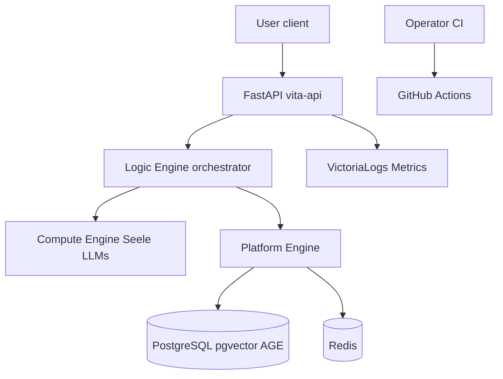

# Threat Model (VITA)

Version: 0.1 (P1)  
Scope: engine7b application stack (FastAPI, Seele LLM, PostgreSQL, Redis, VictoriaLogs)

## System context

## Assets

| Asset | Classification | Impact if compromised |
|-------|----------------|------------------------|
| Conversation content | T2-T3 | Privacy breach, psychological harm |
| Crisis / private logs | T3 | Severe privacy and trust breach |
| JWT / API keys | Credential | Account takeover, data exfiltration |
| DB credentials | Credential | Full data store access |
| LLM prompts and persona | T1 operational | Manipulation of companion behavior |
| User embeddings (GSW) | T2 | Inference of emotional history |

See [../database/data-classification.md](../database/data-classification.md).

## Trust boundaries

1. **User to API**: HTTPS, auth when enabled, rate limiting
2. **API to LLM services**: Internal network; no user credentials forwarded
3. **API to PostgreSQL/Redis**: Credentials from `config/.env.compose` / GitHub Secrets (via compose_env)
4. **API to VictoriaLogs**: Non-private log streams only; T3 never shipped
5. **CI to repository**: Read-only; no secrets in workflow files

## STRIDE summary

| Threat | Example | Mitigation |
|--------|---------|------------|
| Spoofing | Fake API client | JWT/API key when AUTH_ENABLED; CORS restrictions |
| Tampering | Modified crisis responses | Companion language policy + clinical tests in CI |
| Repudiation | Deny escalation event | audit.log, crisis_events table, private log |
| Information disclosure | Private content in VictoriaLogs | private log_type excluded from shipper |
| Denial of service | Chat flood | Rate limiting (config); LLM timeouts |
| Elevation of privilege | Default dev secrets in production | config validation rejects dev_* secrets in production |
| Supply chain | Vulnerable dependency in runtime | pip-audit CI gate on `requirements-audit.txt`; only Verified Creator GitHub Actions |

## Companion-specific threats

| Threat | User impact | Control |
|--------|-------------|---------|
| Institutional language in crisis | Retraumatization; user stops seeking help | FORBIDDEN_PATTERNS + clinical pytest |
| Forced medical pathway via AI | Loss of autonomy | No hotline/ER/hospital text in user layer |
| Prompt injection | Unsafe replies | Safety hub validation; orchestrator fallbacks |
| Cross-session data leak | Broken trust | Session-scoped DB queries; user_id on facts |

## Out of scope (P1)

- Formal penetration test report
- SOC2 control mapping
- Multi-region DR threat analysis

## Review cadence

- Review on major architecture changes
- Review when adding new external integrations or log sinks
- Link updates in PR using security checklist
